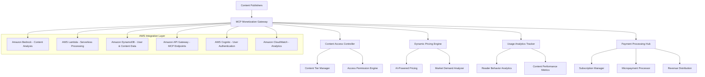

# Content Monetization Design Document

## Overview

This design focuses specifically on how Model Context Protocol (MCP) servers can revolutionize content monetization in the publishing industry. The solution addresses the critical challenge of declining traditional revenue streams by creating new, technology-enabled monetization opportunities through structured content access and intelligent pricing models.

## Architecture

### Content Monetization MCP Server Architecture



## Core Components

### 1. MCP Content Access Controller

**Purpose**: Manages tiered content access based on subscription levels, payment status, and content value.

**Key Features**:
- **Dynamic Content Gating**: Real-time decisions on content accessibility
- **Subscription Tier Management**: Multiple access levels (Free, Premium, Enterprise)
- **Content Value Assessment**: AI-powered content scoring for pricing decisions
- **Access Token Management**: Secure, time-limited content access tokens

**MCP Protocol Implementation**:
```typescript
interface ContentAccessMCP {
  tools: [
    {
      name: "check_content_access",
      description: "Verify user access rights for specific content",
      inputSchema: {
        type: "object",
        properties: {
          userId: { type: "string" },
          contentId: { type: "string" },
          accessLevel: { type: "string", enum: ["free", "premium", "enterprise"] }
        }
      }
    },
    {
      name: "grant_temporary_access",
      description: "Provide time-limited access to premium content",
      inputSchema: {
        type: "object",
        properties: {
          userId: { type: "string" },
          contentId: { type: "string" },
          duration: { type: "number" },
          paymentToken: { type: "string" }
        }
      }
    }
  ]
}
```

### 2. Dynamic Pricing Engine

**Purpose**: AI-powered pricing optimization based on content demand, user behavior, and market conditions.

**Pricing Models Supported**:
- **Subscription Tiers**: Monthly/annual recurring revenue
- **Pay-per-Article**: Micropayments for individual content pieces
- **Usage-Based**: Pricing based on content consumption volume
- **Dynamic Pricing**: Real-time price adjustments based on demand
- **Bundle Pricing**: Package deals for content collections

**AWS Integration**:
- **Amazon Bedrock**: Content quality and demand prediction
- **Amazon SageMaker**: Machine learning models for price optimization
- **Amazon Personalize**: Personalized pricing recommendations

**Pricing Algorithm Features**:
- Content freshness and exclusivity scoring
- Reader engagement prediction
- Competitive pricing analysis
- Seasonal demand adjustments
- User willingness-to-pay estimation

### 3. Revenue Analytics and Optimization

**Purpose**: Comprehensive analytics to maximize revenue through data-driven insights.

**Analytics Capabilities**:
- **Revenue Attribution**: Track revenue sources across content types
- **Conversion Funnel Analysis**: Optimize free-to-paid conversion rates
- **Content ROI Measurement**: Identify highest-performing content
- **Churn Prediction**: Proactive retention strategies
- **Price Elasticity Analysis**: Optimize pricing for maximum revenue

**Key Metrics Tracked**:
- Average Revenue Per User (ARPU)
- Customer Lifetime Value (CLV)
- Content engagement rates
- Subscription conversion rates
- Payment completion rates
- Revenue per content piece

### 4. Payment Processing Integration

**Purpose**: Seamless payment processing for multiple monetization models.

**Payment Methods Supported**:
- Credit/debit cards
- Digital wallets (Apple Pay, Google Pay)
- Cryptocurrency payments
- Bank transfers
- Subscription billing
- Micropayment processing

**AWS Payment Integration**:
- **AWS Payment Cryptography**: Secure payment processing
- **Amazon EventBridge**: Payment event handling
- **AWS Lambda**: Serverless payment processing
- **Amazon DynamoDB**: Transaction and billing data storage

## Technical Implementation Details

### 1. MCP Server Endpoints

**Content Access Endpoints**:
```
GET /mcp/content/access/{contentId}
POST /mcp/content/purchase
GET /mcp/content/subscription/status
POST /mcp/content/subscription/upgrade
```

**Pricing Endpoints**:
```
GET /mcp/pricing/content/{contentId}
POST /mcp/pricing/dynamic
GET /mcp/pricing/subscription/tiers
POST /mcp/pricing/bundle/create
```

**Analytics Endpoints**:
```
GET /mcp/analytics/revenue
GET /mcp/analytics/content/performance
GET /mcp/analytics/user/behavior
POST /mcp/analytics/conversion/track
```

### 2. Data Models

```typescript
interface ContentMonetization {
  contentId: string;
  pricingModel: 'subscription' | 'payPerView' | 'freemium' | 'dynamic';
  basePrice: number;
  currentPrice: number;
  accessTiers: AccessTier[];
  revenueMetrics: RevenueMetrics;
}

interface AccessTier {
  name: string;
  price: number;
  features: string[];
  contentAccess: ContentAccess[];
}

interface RevenueMetrics {
  totalRevenue: number;
  subscriptionRevenue: number;
  oneTimeRevenue: number;
  averageRevenuePerUser: number;
  conversionRate: number;
}
```

### 3. AWS Service Integration

**Amazon Bedrock Integration**:
- Content quality scoring for pricing decisions
- Demand prediction based on content analysis
- Personalized content recommendations for upselling

**AWS Lambda Functions**:
- Real-time pricing calculations
- Payment processing workflows
- Subscription management automation
- Analytics data processing

**Amazon DynamoDB Tables**:
- User subscription data
- Content pricing history
- Payment transactions
- Analytics metrics

## Business Model Implementation

### Revenue Stream Optimization

**1. Subscription Revenue (60% of total revenue target)**:
- Tiered subscription models (Basic, Premium, Enterprise)
- Annual subscription discounts (15-20% savings)
- Family and team subscription plans
- Corporate enterprise licensing

**2. Pay-per-Content Revenue (25% of total revenue target)**:
- Premium article access ($0.99-$4.99 per article)
- Exclusive interview and analysis content
- Breaking news and time-sensitive content
- Expert commentary and opinion pieces

**3. Data and Insights Revenue (15% of total revenue target)**:
- Anonymized reader behavior data licensing
- Content performance analytics for advertisers
- Market trend reports for industry stakeholders
- Custom research and analysis services

### Pricing Strategy

**Dynamic Pricing Implementation**:
- Peak demand pricing (20-50% premium during high-traffic periods)
- Content age-based pricing (premium for fresh content, discounts for older content)
- User behavior-based pricing (personalized pricing based on engagement history)
- Competitive pricing adjustments (real-time market comparison)

**Conversion Optimization**:
- Free trial periods (7-30 days)
- Freemium content teasers (first 3 paragraphs free)
- Limited-time promotional pricing
- Referral and loyalty program discounts

## Success Metrics and KPIs

### Revenue Metrics
- **Target ARPU Growth**: 25-40% increase within 12 months
- **Subscription Conversion Rate**: 8-15% from free to paid users
- **Revenue Diversification**: Reduce dependence on single revenue stream by 30%
- **Customer Lifetime Value**: Increase CLV by 50% through retention strategies

### Operational Metrics
- **Payment Processing Success Rate**: >99.5%
- **Content Access Response Time**: <200ms
- **Pricing Calculation Speed**: <100ms
- **System Uptime**: 99.9% availability

### User Experience Metrics
- **Payment Completion Rate**: >95%
- **Subscription Renewal Rate**: >80%
- **User Satisfaction Score**: >4.5/5
- **Support Ticket Volume**: <2% of active users

## Implementation Roadmap

### Phase 1: Foundation (Months 1-2)
- MCP server basic architecture setup
- AWS service integration (Lambda, DynamoDB, API Gateway)
- Basic subscription management system
- Simple payment processing integration

### Phase 2: Core Monetization (Months 3-4)
- Dynamic pricing engine implementation
- Content access control system
- Analytics and reporting dashboard
- Multi-tier subscription management

### Phase 3: Advanced Features (Months 5-6)
- AI-powered pricing optimization
- Advanced analytics and insights
- Revenue optimization algorithms
- Enterprise features and APIs

### Phase 4: Scale and Optimize (Months 7-8)
- Performance optimization and scaling
- Advanced security implementations
- International payment support
- Revenue forecasting and planning tools

## Risk Mitigation

### Technical Risks
- **Payment Processing Failures**: Implement redundant payment providers
- **Pricing Algorithm Errors**: Comprehensive testing and gradual rollout
- **Data Security Breaches**: End-to-end encryption and AWS security best practices
- **System Scalability**: Auto-scaling AWS infrastructure and load testing

### Business Risks
- **User Resistance to Paid Content**: Gradual transition with value demonstration
- **Competitive Pricing Pressure**: Differentiation through unique content and features
- **Revenue Cannibalization**: Careful balance between free and paid content
- **Regulatory Compliance**: GDPR, CCPA, and payment industry compliance

## Expected Outcomes

### Financial Impact
- **Revenue Increase**: 35-60% increase in total revenue within 18 months
- **Profit Margin Improvement**: 20-30% improvement through optimized pricing
- **Customer Acquisition Cost Reduction**: 25% reduction through improved conversion
- **Revenue Predictability**: 70% recurring revenue through subscriptions

### Competitive Advantages
- **First-mover Advantage**: Early adoption of MCP-based monetization
- **Technology Differentiation**: Advanced AI-powered pricing and personalization
- **Scalable Infrastructure**: Cloud-native architecture for rapid growth
- **Data-Driven Optimization**: Continuous improvement through analytics insights