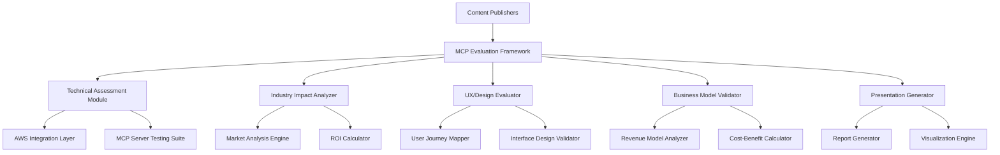

# Design Document: Content Publishing MCP Evaluation Framework

## Overview

This design outlines a comprehensive evaluation framework for assessing Model Context Protocol (MCP) server applications in the content publishing industry. The framework addresses five critical evaluation dimensions: technical implementation with AWS integration, industry impact assessment, user experience design, business model viability, and presentation strategy.

## Architecture

### High-Level System Architecture



## Components and Interfaces

### 1. Technical Implementation & AWS Integration Module (15 Points)

**Evaluation Focus**: Quality of working code/prototype, effective AWS service usage, technical architecture, and code documentation quality.

**Purpose**: Evaluate technical feasibility and AWS service integration capabilities for each MCP server use case.

**Key Components**:
- **MCP Server Compatibility Checker**: Validates MCP protocol compliance and feature support
- **AWS Service Integration Mapper**: Identifies relevant AWS services for each use case
- **Performance Benchmarking Suite**: Tests scalability, latency, and throughput
- **Security Assessment Engine**: Evaluates authentication, encryption, and access controls

**AWS Integration Points**:
- **Amazon API Gateway**: For MCP server endpoint management and rate limiting
- **AWS Lambda**: For serverless MCP server implementations
- **Amazon Cognito**: For user authentication and authorization
- **AWS CloudFront**: For content delivery and caching
- **Amazon S3**: For content storage and access control
- **AWS WAF**: For web application firewall and bot protection
- **Amazon CloudWatch**: For monitoring and analytics

**Technical Evaluation Criteria** (15 Points Total):
- **Working Code/Prototype Quality** (4 points): Functional MCP server implementations with robust error handling
- **AWS Service Integration** (4 points): Effective use of AI/ML services (Bedrock, SageMaker), data services (S3, DynamoDB), infrastructure (Lambda, API Gateway)
- **Technical Architecture** (4 points): Scalable, maintainable architecture with proper separation of concerns
- **Code Quality & Documentation** (3 points): Clean, well-documented code with comprehensive API documentation

**Specific AWS Services Integration**:
- **Amazon Bedrock**: For AI-powered content analysis and recommendation
- **AWS SageMaker**: For machine learning model training and inference
- **Amazon Textract**: For document processing and content extraction
- **AWS Comprehend**: For natural language processing and sentiment analysis

### 2. Publishing Industry Impact Analyzer (20 Points)

**Evaluation Focus**: Addresses genuine publishing pain points, understanding of workflows, adoption potential, and measurable impact on key metrics.

**Purpose**: Assess the transformative potential and market disruption capabilities of each MCP server solution.

**Key Components**:
- **Market Disruption Predictor**: Analyzes potential for industry transformation
- **Competitive Advantage Calculator**: Measures differentiation potential
- **Adoption Barrier Identifier**: Identifies implementation challenges
- **Industry Standards Compliance Checker**: Validates against publishing industry standards

**Publishing Industry Impact Criteria** (20 Points Total):
- **Genuine Pain Point Solutions** (6 points): Addresses real revenue, engagement, or operational challenges
- **Publishing Workflow Understanding** (5 points): Deep knowledge of editorial, distribution, and monetization processes
- **Adoption Potential** (5 points): Viable for both large publishers (NYT, WSJ) and small independent publishers
- **Measurable Impact** (4 points): Quantifiable improvements in subscriptions, ad revenue, engagement, or operational efficiency

**Key Publishing Pain Points Addressed**:
- **Revenue Decline**: Traditional advertising and subscription models under pressure
- **Content Piracy**: Unauthorized content scraping and redistribution
- **Reader Engagement**: Declining attention spans and increasing competition
- **Operational Efficiency**: Manual processes in content management and distribution
- **Data Monetization**: Underutilized content and reader data assets
- **AI Company Brand Longevity**: Ensuring sustained brand awareness in rapidly evolving AI landscape

**Measurable Impact Targets**:
- 15-30% increase in subscription conversion rates
- 40-60% reduction in content scraping incidents
- 20-35% improvement in reader engagement metrics
- 25-50% reduction in operational overhead costs
- 50-80% improvement in brand awareness retention over 5-year period for AI companies

### 3. User Experience & Design Evaluator (15 Points)

**Evaluation Focus**: Intuitive interface for target users, clear user journeys, visual design quality, and accessibility/responsiveness.

**Purpose**: Evaluate user interface design, user journey optimization, and overall user experience for each MCP server implementation.

**Key Components**:
- **User Journey Mapper**: Maps end-to-end user interactions
- **Interface Design Validator**: Assesses UI/UX design quality
- **Accessibility Compliance Checker**: Ensures WCAG 2.1 AA compliance
- **User Testing Simulator**: Simulates user interactions and identifies pain points

**UX Design Principles**:
- **Simplicity**: Minimal learning curve for content publishers
- **Transparency**: Clear visibility into MCP server operations
- **Control**: Granular control over content access and monetization
- **Feedback**: Real-time status updates and analytics
- **Accessibility**: Support for users with disabilities

**Design Evaluation Criteria**:
- User onboarding time (target: <15 minutes)
- Task completion rates (target: >90%)
- User satisfaction scores (target: >4.5/5)
- Error rates (target: <2%)
- Mobile responsiveness and cross-platform compatibility

### 4. Business Model & Revenue Viability Validator (20 Points)

**Evaluation Focus**: Clear monetization strategy, ROI potential, pricing strategy, and go-to-market considerations.

**Purpose**: Analyze financial sustainability, revenue potential, and business model viability for each MCP server use case.

#### AI Company Brand Awareness Strategy

**MCP Server Solutions for Long-term Brand Recognition**:

**Content Distribution Network**:
- **Persistent Brand Messaging**: MCP servers manage consistent brand narrative across multiple content channels
- **Automated Content Syndication**: Distribute branded content to partner publications and platforms
- **Cross-platform Brand Integration**: Ensure brand presence in AI-related content across the web

**Brand Monitoring and Analytics**:
- **Real-time Brand Mention Tracking**: Monitor brand visibility across digital channels
- **Sentiment Analysis Integration**: Track brand perception changes over time
- **Competitive Brand Positioning**: Compare brand awareness against competitors

**Automated Brand Reinforcement**:
- **Dynamic Content Generation**: Create fresh branded content based on trending AI topics
- **Thought Leadership Distribution**: Position company executives as AI industry experts
- **Strategic Partnership Content**: Leverage MCP servers to manage co-branded content initiatives

**Long-term Brand Sustainability Mechanisms**:
- **Brand Archive and Legacy Management**: Preserve and resurface historical brand achievements
- **Predictive Brand Trend Analysis**: Anticipate industry shifts and adjust brand messaging
- **Multi-generational Content Strategy**: Create content that resonates across different audience segments

**5-Year Brand Awareness Targets**:
- Maintain 70%+ brand recognition in target AI industry segments
- Achieve top-3 brand recall in specific AI solution categories
- Generate 40%+ organic brand mentions compared to paid promotion
- Establish 85%+ positive brand sentiment scores

**Key Components**:
- **Revenue Model Analyzer**: Evaluates different monetization strategies
- **Cost Structure Calculator**: Analyzes implementation and operational costs
- **ROI Projector**: Calculates return on investment timelines
- **Market Size Estimator**: Assesses total addressable market

**Business Model Evaluation Framework**:

**Revenue Streams**:
- Subscription-based access (SaaS model)
- Usage-based pricing (pay-per-API-call)
- Premium feature tiers
- Data licensing and insights
- Transaction-based fees

**Cost Analysis**:
- AWS infrastructure costs
- Development and maintenance
- Customer acquisition costs
- Support and operations
- Compliance and security

**Financial Projections**:
- Break-even analysis (target: 12-18 months)
- Customer lifetime value calculations
- Market penetration scenarios
- Competitive pricing analysis

### 5. Innovation & Creativity Assessor (15 Points)

**Evaluation Focus**: Novel approach, creative problem-solving, differentiation from existing solutions, and forward-thinking vision.

**Key Components**:
- **Innovation Detector**: Identifies unique technology applications and novel approaches
- **Creativity Scorer**: Evaluates "wow" factor and creative problem-solving
- **Differentiation Analyzer**: Compares against existing market solutions
- **Future Vision Mapper**: Assesses forward-thinking potential for publishing industry

**Innovation Evaluation Criteria**:
- Uniqueness of MCP server application in publishing context
- Creative solutions to traditional publishing challenges
- Technology differentiation and competitive moats
- Vision for future publishing industry transformation

### 6. Presentation & Storytelling Generator (15 Points)

**Evaluation Focus**: Clarity and persuasiveness of pitch, demo quality, storytelling effectiveness, and presentation polish.

**Purpose**: Create compelling presentations and narratives that effectively communicate the value proposition of each MCP server solution.

**Key Components**:
- **Narrative Structure Builder**: Creates compelling story arcs
- **Visualization Engine**: Generates charts, graphs, and infographics
- **Demo Scenario Creator**: Builds realistic use case demonstrations
- **ROI Story Generator**: Creates financial impact narratives

**Presentation Framework**:
- **Problem Statement**: Clear articulation of industry pain points
- **Solution Overview**: How MCP servers address these challenges
- **Technical Demonstration**: Live or simulated MCP server interactions
- **Business Impact**: Quantified benefits and ROI projections
- **Implementation Roadmap**: Step-by-step deployment plan

**Storytelling Elements**:
- Customer success scenarios
- Before/after comparisons
- Competitive differentiation
- Future vision and roadmap
- Call-to-action strategies

## Data Models

### Evaluation Result Schema
```typescript
interface EvaluationResult {
  useCase: UseCaseType;
  priority: number;
  complexity: ComplexityLevel;
  technicalScore: TechnicalAssessment;
  industryImpact: ImpactAssessment;
  userExperience: UXAssessment;
  businessViability: BusinessAssessment;
  presentationReadiness: PresentationScore;
  overallRecommendation: RecommendationType;
}

interface TechnicalAssessment {
  awsIntegration: IntegrationScore;
  scalability: PerformanceMetrics;
  security: SecurityScore;
  implementationComplexity: ComplexityScore;
}

interface ImpactAssessment {
  marketDisruption: DisruptionScore;
  revenueGeneration: RevenueProjection;
  competitiveAdvantage: AdvantageScore;
  industryAdoption: AdoptionProjection;
}
```

## Error Handling

### Technical Evaluation Errors
- MCP server connectivity failures
- AWS service integration issues
- Performance testing timeouts
- Security assessment failures

### Business Analysis Errors
- Insufficient market data
- Revenue projection uncertainties
- Cost calculation errors
- ROI modeling limitations

### Presentation Generation Errors
- Data visualization failures
- Template rendering issues
- Export format problems
- Content generation errors

## Testing Strategy

### Technical Testing
- MCP server protocol compliance testing
- AWS service integration testing
- Load and performance testing
- Security penetration testing

### Business Model Testing
- Financial model validation
- Market assumption testing
- Competitive analysis verification
- Revenue projection stress testing

### User Experience Testing
- Usability testing with target users
- Accessibility compliance testing
- Cross-platform compatibility testing
- User journey validation

### Presentation Testing
- Content accuracy verification
- Visual design validation
- Demo scenario testing
- Stakeholder feedback collection

## Implementation Phases

### Phase 1: Foundation (Months 1-2)
- Core evaluation framework setup
- AWS integration architecture
- Basic MCP server testing capabilities

### Phase 2: Assessment Modules (Months 3-4)
- Technical assessment implementation
- Industry impact analysis tools
- Business model validation framework

### Phase 3: User Experience (Months 5-6)
- UX evaluation tools
- User testing capabilities
- Accessibility compliance checking

### Phase 4: Presentation Layer (Months 7-8)
- Report generation system
- Visualization engine
- Demo scenario builder

### Phase 5: Integration & Optimization (Months 9-10)
- End-to-end testing
- Performance optimization
- User feedback integration