# Content Monetization & Brand Preservation Design Document

## Overview

This design addresses the existential threat facing publishers in the AI era: while Big Tech companies like OpenAI pay fairly for content through licensing deals, users increasingly consume content through AI interfaces (ChatGPT, Claude, etc.) rather than visiting publisher websites directly. Over time, this erodes brand recognition and value, potentially making publishers irrelevant despite their content being widely used.

Our MCP-based solution ensures publishers can future-proof their AI deals by embedding rich brand metadata, attribution requirements, and value-added services directly into content delivery, guaranteeing brand visibility and ongoing relevance even when content is consumed through third-party AI interfaces.

## Architecture

### Brand-Preserving Content Monetization Architecture

```mermaid
graph TB
    A[Publishers: Guardian, Industry, Hachette] --> B[MCP Brand Preservation Server]
    B --> C[Content + Brand Metadata Package]
    B --> D[Attribution Requirements Engine]
    B --> E[Brand Visibility Tracker]
    B --> F[Revenue Distribution Hub]
    
    C --> G[Rich Content Metadata]
    C --> H[Brand Identity Package]
    C --> I[Editorial Standards Metadata]
    
    D --> J[Attribution Display Rules]
    D --> K[Brand Badge Requirements]
    D --> L[Fact-Check Verification]
    
    E --> M[Brand Mention Analytics]
    E --> N[User Engagement Tracking]
    
    F --> O[Usage-Based Compensation]
    F --> P[Brand Value Metrics]
    
    subgraph "AI Interface Integration"
        Q[ChatGPT Interface]
        R[Claude Interface]
        S[Gemini Interface]
        T[Future AI Interfaces]
    end
    
    subgraph "Brand Display Layer"
        U[Guardian Badge + Logo]
        V[Fact-Check Verification Badge]
        W[Editorial Quality Score]
        X[Source Attribution Link]
    end
    
    B --> Q
    B --> R
    B --> S
    B --> T
    
    Q --> U
    R --> V
    S --> W
    T --> X
    
    subgraph "AWS Integration Layer"
        Y[Amazon Bedrock - Content Analysis]
        Z[AWS Lambda - Metadata Processing]
        AA[Amazon DynamoDB - Brand & Attribution Data]
        BB[Amazon API Gateway - MCP Endpoints]
        CC[AWS CloudWatch - Brand Visibility Analytics]
    end
    
    B --> Y
    B --> Z
    B --> AA
    B --> BB
    B --> CC
```



## Core Innovation: Brand-Embedded Content Delivery

### The Brand Preservation Challenge

**Current State**: Publishers like The Guardian license content to OpenAI, get paid fairly, but users consume content through ChatGPT without ever visiting theguardian.com. Over 5 years, brand recognition erodes despite content usage.

**Our Solution**: MCP servers that embed rich brand metadata, attribution requirements, and value-added services directly into content, ensuring brand visibility regardless of consumption interface.

### Brand Metadata Format Specification

```json
{
  "content": {
    "text": "Article content here...",
    "title": "Climate Change Report Reveals Shocking Trends",
    "publishDate": "2024-10-24T10:00:00Z"
  },
  "brandMetadata": {
    "publisher": {
      "name": "The Guardian",
      "logo": "https://assets.theguardian.com/logo-badge.svg",
      "brandColor": "#052962",
      "trustScore": 9.2,
      "establishedYear": 1821
    },
    "attribution": {
      "required": true,
      "displayFormat": "badge-with-logo",
      "minimumVisibility": "prominent",
      "linkback": "https://theguardian.com/article/12345"
    },
    "editorial": {
      "factChecked": true,
      "factCheckDate": "2024-10-24T09:30:00Z",
      "editorialStandards": "https://theguardian.com/editorial-code",
      "journalistCredentials": ["Award-winning environmental reporter", "20 years experience"]
    },
    "rights": {
      "usage": "ai-training-permitted",
      "attribution": "mandatory",
      "modification": "summary-only",
      "commercialUse": "licensed"
    },
    "curation": {
      "contentType": "investigative-journalism",
      "expertise": "environmental-science",
      "verificationLevel": "triple-sourced",
      "editorialProcess": "peer-reviewed"
    }
  },
  "displayRequirements": {
    "badges": ["verified-source", "fact-checked", "award-winning-journalism"],
    "minimumAttribution": "The Guardian | Fact-Checked | Est. 1821",
    "brandVisibility": "high-prominence",
    "userInteraction": {
      "allowSaveToGuardian": true,
      "allowSubscriptionPrompt": true,
      "allowNewsletterSignup": true
    }
  }
}
```

## Core Components

### 1. Brand-Embedded Content Controller

**Purpose**: Ensures brand visibility and attribution in AI interfaces while managing content access and monetization.

### How Users See Brand-Preserved Content in AI Interfaces

#### ChatGPT Interface Example:
```
🤖 ChatGPT: Based on recent reporting, climate change is accelerating faster than expected...

📰 **Source: The Guardian** ✅ Fact-Checked | 🏆 Award-Winning Journalism | Est. 1821
   "Climate Change Report Reveals Shocking Trends"
   📊 Trust Score: 9.2/10 | 🔗 Read full article | 📧 Subscribe to Guardian Climate Newsletter
   
   [Content summary with Guardian branding maintained throughout]
   
   💡 This information comes from The Guardian's environmental desk, 
      known for triple-sourced investigative reporting.
```

#### Claude Interface Example:
```
🤖 Claude: According to investigative reporting from The Guardian...

┌─ 📰 THE GUARDIAN ─────────────────────────────────────┐
│ ✅ Fact-Checked | 🏆 Award-Winning | 🔍 Triple-Sourced │
│ Environmental Journalism Since 1821                   │
│ 📊 Editorial Trust Score: 9.2/10                     │
│                                                       │
│ "Climate Change Report Reveals Shocking Trends"       │
│ 🔗 Read full story | 📧 Climate Newsletter           │
└───────────────────────────────────────────────────────┘

[Content with Guardian attribution maintained throughout response]
```

#### Future AI Interface Integration:
```
🤖 AI Assistant: Here's what The Guardian's environmental team discovered...

🏷️ [GUARDIAN BADGE] Verified Source • Fact-Checked • Est. 1821
📈 Trust Metrics: Editorial Excellence 9.2/10 | Reader Trust 94%
🎯 Expertise: Award-winning environmental journalism
🔗 Actions: [Read Full Article] [Subscribe] [More from Guardian]

[AI response with consistent Guardian branding and attribution]
```

**Key Features**:
- **Dynamic Content Gating**: Real-time decisions on content accessibility
- **Subscription Tier Management**: Multiple access levels (Free, Premium, Enterprise)
- **Content Value Assessment**: AI-powered content scoring for pricing decisions
- **Access Token Management**: Secure, time-limited content access tokens

**MCP Protocol Implementation**:
```typescript
interface ContentAccessMCP {
  tools: [
    {
      name: "check_content_access",
      description: "Verify user access rights for specific content",
      inputSchema: {
        type: "object",
        properties: {
          userId: { type: "string" },
          contentId: { type: "string" },
          accessLevel: { type: "string", enum: ["free", "premium", "enterprise"] }
        }
      }
    },
    {
      name: "grant_temporary_access",
      description: "Provide time-limited access to premium content",
      inputSchema: {
        type: "object",
        properties: {
          userId: { type: "string" },
          contentId: { type: "string" },
          duration: { type: "number" },
          paymentToken: { type: "string" }
        }
      }
    }
  ]
}
```

### 2. Dynamic Pricing Engine

**Purpose**: AI-powered pricing optimization based on content demand, user behavior, and market conditions.

**Pricing Models Supported**:
- **Subscription Tiers**: Monthly/annual recurring revenue
- **Pay-per-Article**: Micropayments for individual content pieces
- **Usage-Based**: Pricing based on content consumption volume
- **Dynamic Pricing**: Real-time price adjustments based on demand
- **Bundle Pricing**: Package deals for content collections

**AWS Integration**:
- **Amazon Bedrock**: Content quality and demand prediction
- **Amazon SageMaker**: Machine learning models for price optimization
- **Amazon Personalize**: Personalized pricing recommendations

**Pricing Algorithm Features**:
- Content freshness and exclusivity scoring
- Reader engagement prediction
- Competitive pricing analysis
- Seasonal demand adjustments
- User willingness-to-pay estimation

### 3. Revenue Analytics and Optimization

**Purpose**: Comprehensive analytics to maximize revenue through data-driven insights.

**Analytics Capabilities**:
- **Revenue Attribution**: Track revenue sources across content types
- **Conversion Funnel Analysis**: Optimize free-to-paid conversion rates
- **Content ROI Measurement**: Identify highest-performing content
- **Churn Prediction**: Proactive retention strategies
- **Price Elasticity Analysis**: Optimize pricing for maximum revenue

**Key Metrics Tracked**:
- Average Revenue Per User (ARPU)
- Customer Lifetime Value (CLV)
- Content engagement rates
- Subscription conversion rates
- Payment completion rates
- Revenue per content piece

### 4. Payment Processing Integration

**Purpose**: Seamless payment processing for multiple monetization models.

**Payment Methods Supported**:
- Credit/debit cards
- Digital wallets (Apple Pay, Google Pay)
- Cryptocurrency payments
- Bank transfers
- Subscription billing
- Micropayment processing

**AWS Payment Integration**:
- **AWS Payment Cryptography**: Secure payment processing
- **Amazon EventBridge**: Payment event handling
- **AWS Lambda**: Serverless payment processing
- **Amazon DynamoDB**: Transaction and billing data storage

## Technical Implementation Details

### 1. MCP Server Endpoints

**Brand-Embedded Content Endpoints**:
```
GET /mcp/content/branded/{contentId}
POST /mcp/content/attribution/verify
GET /mcp/brand/metadata/{publisherId}
POST /mcp/brand/visibility/track
```

**Attribution & Rights Endpoints**:
```
GET /mcp/attribution/requirements/{contentId}
POST /mcp/attribution/display/validate
GET /mcp/rights/usage/{contentId}
POST /mcp/rights/compliance/check
```

**Brand Analytics Endpoints**:
```
GET /mcp/analytics/brand/visibility
GET /mcp/analytics/attribution/compliance
GET /mcp/analytics/trust/score
POST /mcp/analytics/brand/engagement/track
```

### 2. Technical Implementation: The Metadata Magic

**MCP Tool for Brand-Embedded Content**:
```typescript
{
  name: "get_branded_content",
  description: "Retrieve content with full brand metadata and attribution requirements",
  inputSchema: {
    type: "object",
    properties: {
      contentId: { type: "string" },
      requestingInterface: { type: "string", enum: ["chatgpt", "claude", "gemini", "other"] },
      displayCapabilities: {
        type: "object",
        properties: {
          supportsBadges: { type: "boolean" },
          supportsRichFormatting: { type: "boolean" },
          supportsInteractiveElements: { type: "boolean" }
        }
      }
    }
  }
}
```

**Response Format**:
```typescript
interface BrandedContentResponse {
  content: {
    text: string;
    title: string;
    summary: string;
  };
  brandPackage: {
    publisher: PublisherMetadata;
    attribution: AttributionRequirements;
    displayElements: DisplayElement[];
    interactionOptions: InteractionOption[];
  };
  complianceTracking: {
    trackingId: string;
    requiredMetrics: string[];
    reportingEndpoint: string;
  };
}
```

### 2. Data Models

```typescript
interface ContentMonetization {
  contentId: string;
  pricingModel: 'subscription' | 'payPerView' | 'freemium' | 'dynamic';
  basePrice: number;
  currentPrice: number;
  accessTiers: AccessTier[];
  revenueMetrics: RevenueMetrics;
}

interface AccessTier {
  name: string;
  price: number;
  features: string[];
  contentAccess: ContentAccess[];
}

interface RevenueMetrics {
  totalRevenue: number;
  subscriptionRevenue: number;
  oneTimeRevenue: number;
  averageRevenuePerUser: number;
  conversionRate: number;
}
```

### 3. AWS Service Integration

**Amazon Bedrock Integration**:
- Content quality scoring for pricing decisions
- Demand prediction based on content analysis
- Personalized content recommendations for upselling

**AWS Lambda Functions**:
- Real-time pricing calculations
- Payment processing workflows
- Subscription management automation
- Analytics data processing

**Amazon DynamoDB Tables**:
- User subscription data
- Content pricing history
- Payment transactions
- Analytics metrics

## Business Model: Solving the Existential Brand Threat

### The $100 Billion Problem
Publishers face an existential crisis: AI companies consume their content through licensing deals, but users never visit publisher websites. Brand value erodes over 5 years, making publishers irrelevant despite content usage.

### Revenue Stream Revolution

**1. Brand Preservation Revenue (40% of total revenue target)**:
- **Attribution Licensing**: Premium fees for guaranteed brand visibility in AI responses
- **Brand Metadata Services**: Ongoing revenue for maintaining brand identity packages
- **Trust Score Monetization**: Higher compensation for verified, fact-checked content
- **Editorial Standards Licensing**: Premium for content with editorial quality guarantees

**2. Enhanced Content Licensing (35% of total revenue target)**:
- **Metadata-Rich Content**: 3-5x premium over basic text licensing
- **Fact-Check Verification Services**: Additional revenue for verified content
- **Editorial Expertise Licensing**: Premium for journalist credentials and expertise metadata
- **Curation Services**: Revenue for content categorization and quality scoring

**3. Direct User Engagement (25% of total revenue target)**:
- **AI-Interface Subscriptions**: Users subscribe to Guardian content within ChatGPT
- **Newsletter Signups**: Direct conversion from AI interfaces to publisher newsletters
- **Premium Content Access**: Exclusive content accessible only through brand-verified channels
- **Merchandise and Brand Extensions**: Leveraging maintained brand recognition

### Pricing Strategy

**Dynamic Pricing Implementation**:
- Peak demand pricing (20-50% premium during high-traffic periods)
- Content age-based pricing (premium for fresh content, discounts for older content)
- User behavior-based pricing (personalized pricing based on engagement history)
- Competitive pricing adjustments (real-time market comparison)

**Conversion Optimization**:
- Free trial periods (7-30 days)
- Freemium content teasers (first 3 paragraphs free)
- Limited-time promotional pricing
- Referral and loyalty program discounts

## Success Metrics and KPIs

### Revenue Metrics
- **Target ARPU Growth**: 25-40% increase within 12 months
- **Subscription Conversion Rate**: 8-15% from free to paid users
- **Revenue Diversification**: Reduce dependence on single revenue stream by 30%
- **Customer Lifetime Value**: Increase CLV by 50% through retention strategies

### Operational Metrics
- **Payment Processing Success Rate**: >99.5%
- **Content Access Response Time**: <200ms
- **Pricing Calculation Speed**: <100ms
- **System Uptime**: 99.9% availability

### User Experience Metrics
- **Payment Completion Rate**: >95%
- **Subscription Renewal Rate**: >80%
- **User Satisfaction Score**: >4.5/5
- **Support Ticket Volume**: <2% of active users

## Implementation Roadmap

### Phase 1: Foundation (Months 1-2)
- MCP server basic architecture setup
- AWS service integration (Lambda, DynamoDB, API Gateway)
- Basic subscription management system
- Simple payment processing integration

### Phase 2: Core Monetization (Months 3-4)
- Dynamic pricing engine implementation
- Content access control system
- Analytics and reporting dashboard
- Multi-tier subscription management

### Phase 3: Advanced Features (Months 5-6)
- AI-powered pricing optimization
- Advanced analytics and insights
- Revenue optimization algorithms
- Enterprise features and APIs

### Phase 4: Scale and Optimize (Months 7-8)
- Performance optimization and scaling
- Advanced security implementations
- International payment support
- Revenue forecasting and planning tools

## Risk Mitigation

### Technical Risks
- **Payment Processing Failures**: Implement redundant payment providers
- **Pricing Algorithm Errors**: Comprehensive testing and gradual rollout
- **Data Security Breaches**: End-to-end encryption and AWS security best practices
- **System Scalability**: Auto-scaling AWS infrastructure and load testing

### Business Risks
- **User Resistance to Paid Content**: Gradual transition with value demonstration
- **Competitive Pricing Pressure**: Differentiation through unique content and features
- **Revenue Cannibalization**: Careful balance between free and paid content
- **Regulatory Compliance**: GDPR, CCPA, and payment industry compliance

## Innovation & Creativity: Forward-Thinking Vision

### Revolutionary Approach
This isn't workflow automation - it's **brand survival technology**. We're creating the first system that ensures publisher brand identity persists in the AI-dominated future.

### "Wow" Factor Innovations
- **Living Brand Metadata**: Dynamic brand information that evolves with publisher reputation
- **Trust Score Integration**: Real-time credibility scoring visible in all AI interfaces
- **Editorial DNA Tracking**: Unique publisher "fingerprints" that identify content origin
- **Cross-Platform Brand Consistency**: Unified brand experience across all AI platforms

### Differentiation from Existing Solutions
- **Beyond Content Licensing**: We license brand identity, not just text
- **Proactive Brand Protection**: Prevents brand erosion before it happens
- **AI-Native Design**: Built specifically for AI consumption, not web browsing
- **Publisher Empowerment**: Gives publishers control over their brand destiny

### Future Vision for Publishing
- **Brand-First AI Consumption**: Users choose content based on trusted publisher brands
- **Publisher Renaissance**: Strong brands become more valuable in AI era, not less
- **Sustainable AI Ecosystem**: Fair compensation tied to brand value and trust
- **Democratic Information**: Quality journalism remains identifiable and valued

## Expected Outcomes

### Existential Threat Mitigation
- **Brand Recognition Preservation**: Maintain 80%+ brand awareness over 5 years
- **Revenue Protection**: Prevent 60-80% revenue loss from brand erosion
- **Market Position Defense**: Maintain competitive advantage in AI-driven content consumption
- **Publisher Relevance**: Ensure publishers remain essential in information ecosystem

### Financial Impact
- **Revenue Multiplication**: 200-400% increase in content licensing value through brand metadata
- **Brand Value Preservation**: Maintain $50M-$500M in brand equity per major publisher
- **Sustainable AI Revenue**: Create predictable, growing revenue from AI partnerships
- **Market Leadership**: Position early adopters as premium content providers

### Industry Transformation
- **New Industry Standard**: Establish brand-embedded content as the norm
- **Publisher Empowerment**: Shift power balance back toward content creators
- **Quality Journalism Protection**: Ensure high-quality reporting remains identifiable and valued
- **Sustainable Information Ecosystem**: Create fair compensation model for the AI era